# 2024CSIG青年科学家会议

# 前言

 承蒙导师垂青，有幸作为校方代表参与此次为期三天的学术盛会。尽管自诩难称"学术饕餮"，但若论及对学术热忱的饥渴程度，倒颇有几分"学术候鸟"的执着（当然，会议茶歇的美味也着实令人难以抗拒）。

 面对平行进行的十余个分论坛，我提前数日便着手制定学术日程：依据研究兴趣标注重点场次，设计多维度的会议记录模板。得益于周密的准备，最终成功覆盖各前沿领域的主旨报告。

 尤为难得的是，通过实时笔记与晚间复盘相结合的方式，实现了学术养分的深度吸收。现选取最具启发的三场讲座，就其核心观点与创新方法论进行系统性梳理。

# 会议分享

## 探索面向图数据的大模型-石川（北邮）
 
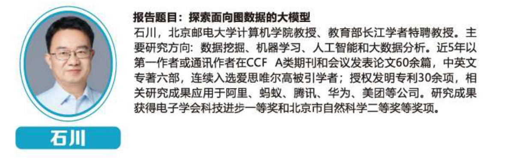
 
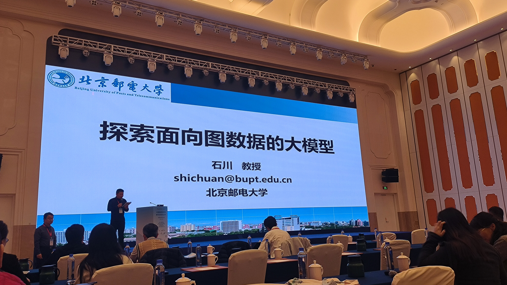

 
> 垂直领域大模型这块，热度还是很高的，来学习的人数是上午场次最多的

 之前我有在接触用图神经网络来优化花型问题，对这方面有一定学习基础，并还算抱有浓厚兴趣的。说实话，北邮也算是我的考研梦中情校之一。所以，这次讲座，也算我的必看list的首选。

 **会议中的这张图，真的非常有含金量，一图总结了GNN的历程，一定要好好反复学习这点：**

 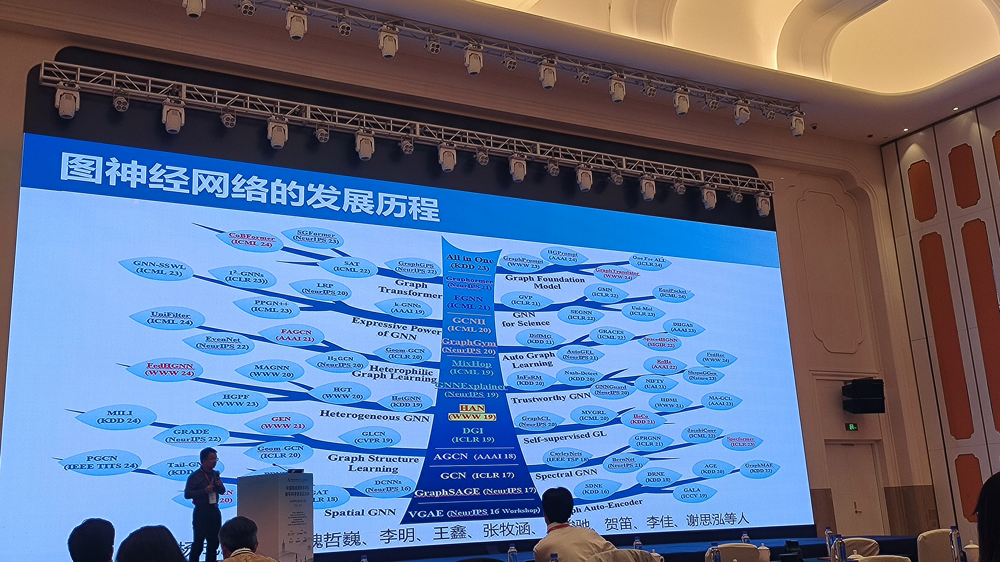

 **一言总结会议内容**——“苹果和菠萝的PPAP既视感”

 关于北邮图实验室，目前在研究图的基础大模型，就是专研能否让GNN发挥LLM的作用。LLM干不了GNN的细活，GNN干不了LLM的粗活。那么图基础模型的目标，就是啪的一下，把两者整合，取长补短，兼容并包。

 当然，图基础模型总体还处于探索阶段，目前主要思路是三种：
- 主要基于GNN优化
- 主要基于LLM优化
- 两者结合

 目前北邮做了很多探索工作，也是走在最前沿。实验室的宣传也很响亮。
 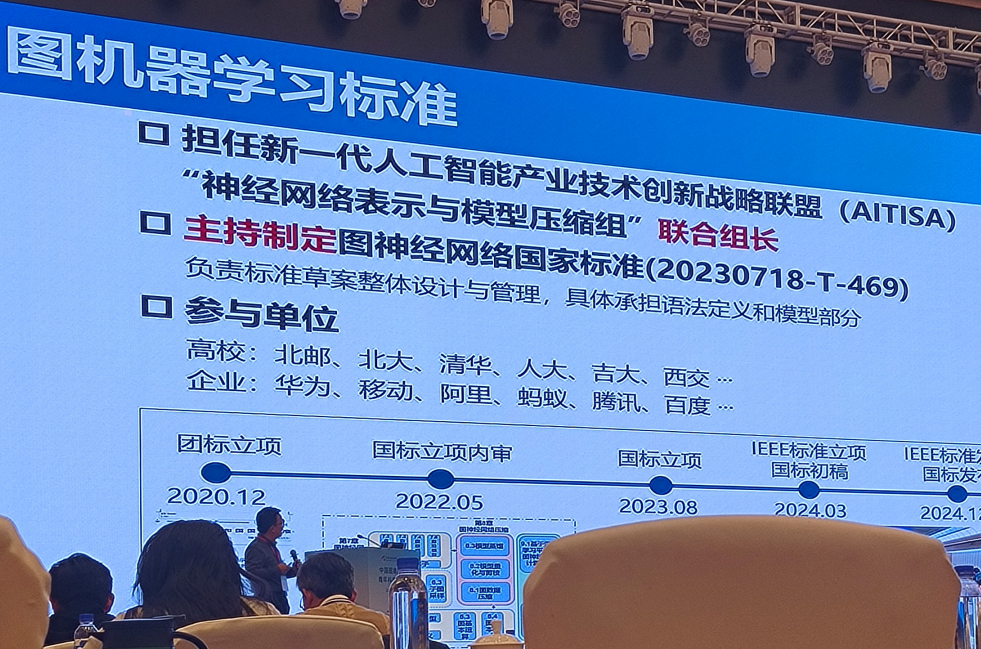

 提问环节，台下提的问题很尖锐——相同的数据结构（图结构），不同的语义信息，这种数据作为训练集，该如何处理？石川教授坦言，这是目前难点。（大会中很多论坛的提问环节，提出的问题很多都是当前领域的难点，这些问题都非常有价值）

## 面向实时渲染的AI超分辨率技术-过洁（南京大学）

 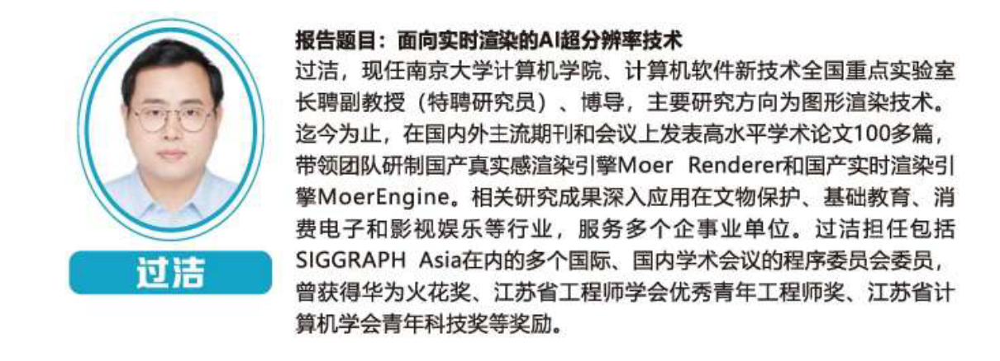

 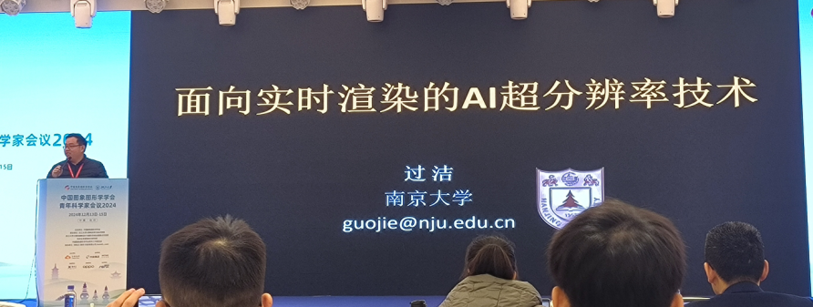

 南大算是我梦中情校top1，本次大会有南大学者的论坛，我都特别关注了。并且“超分”我也在接触，所以这次讲座我也非常期待。

 **让我印象非常好的是，过洁老师的讲座是我个人评价的讲座top1。**

 节奏快且思路清晰，案例通俗易懂，让我直呼精彩。

 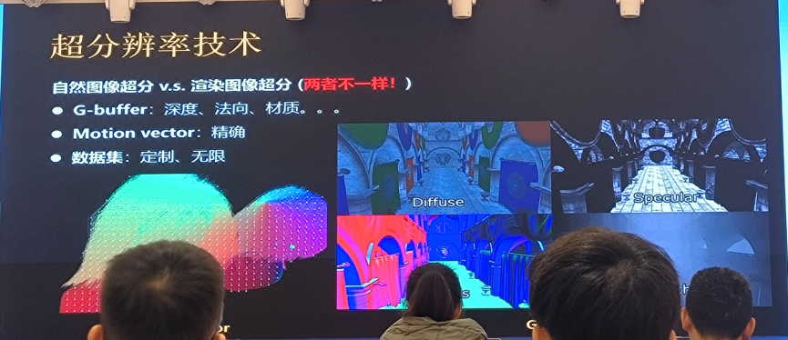

 **一言以总结——渲染超分工作好**

 本次讲座中，过老师以NVIDIA DLSS为例，介绍了渲染超分。又说明了，相比自然图像超分，渲染超分有许多优势——数据集多（计算机内的数据集要多少有多少），预处理算法多（有G-buffer加持），有Motion vector（处理精确）。此外，还提到了南大实验室的补帧、知识蒸馏等工作，效果都非常惊艳。

## 博士生论坛

### 高保真的三维数字人纹理生成与服饰建模，唐俊姝（上海交通大学）

 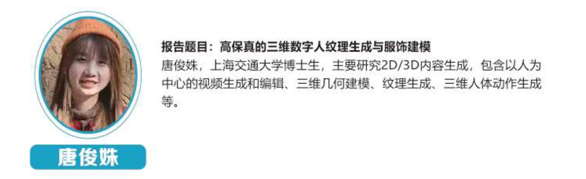

 这领域我算了解比较多了，服饰建模与我们学校主攻领域非常契合，数字人纹理生成这方面paper也看了几篇。
 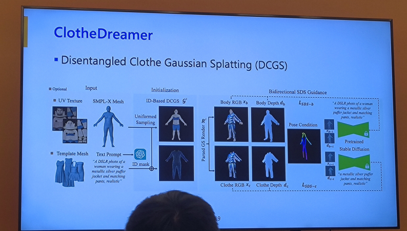

 总结了下贡献与做法：
- 贡献了该领域最高清（1024X1024）、数据量最大的数据集
- 纹理生成办法，跟我所了解的主流方法差不多——对SD微调，某几层冻结，某几层调整
- 几个关键词也是所熟知的几个——UV、GPT反推打标

值得 一提的是，也提到了我现在关注的论文dresscode。果然，相似领域的关注点都是类似的。

 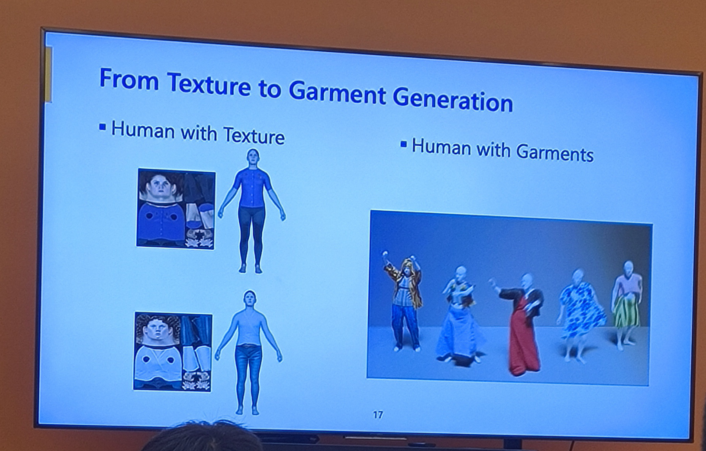

### 利用扩散模型破译甲骨文语言，管海粟（华中科技大学）

 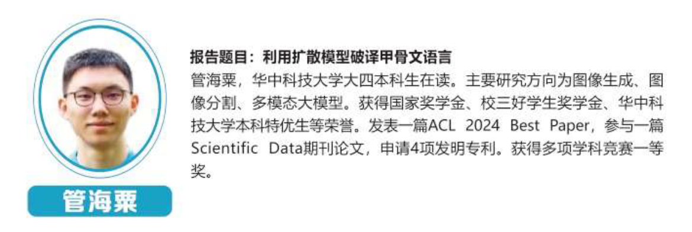

 大四，直博，ACL最佳论文，四项专利。大佬的title就是小众。

 下面的思路很值得我学习。
 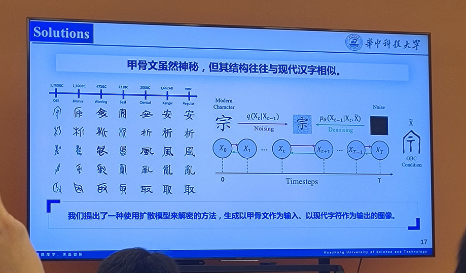

 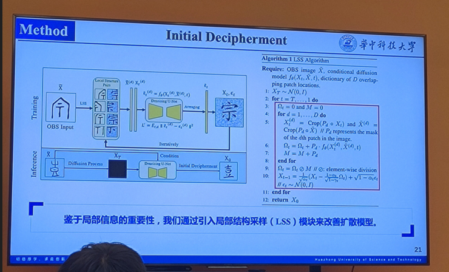

 对字体进行了，甲骨文和现代词汇的风格迁移、对甲骨文结构鲜明部分进行结构学习LLS、还用上了结构学习。

 几个方法都不陌生，实际也是用了基础操作，玩的还是扩散模型那一套。但人家就是学会了神经网络的本质和基础，解决了非常好的实用问题。真的是做到了，发现了问题的主要矛盾。

 这几点真的非常有启发价值。

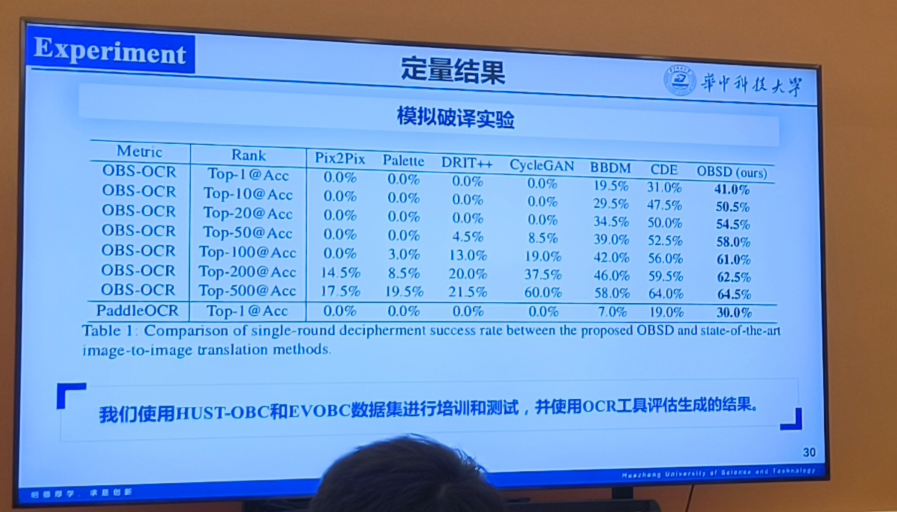

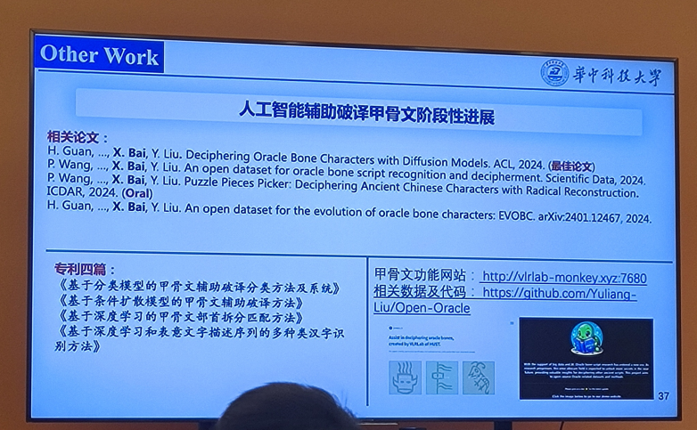

## 学件与异构大模型 周志华 (南京大学)

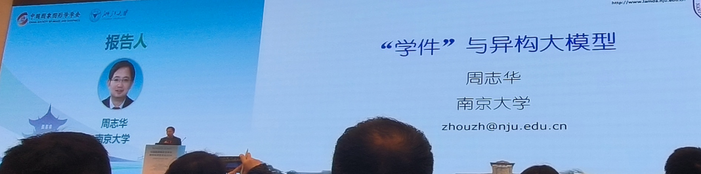

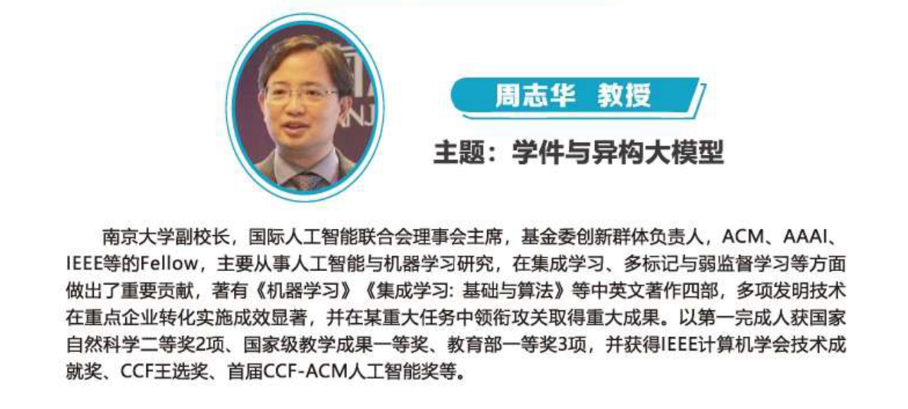

 大名鼎鼎的“西瓜书”的作者，周志华教授。作为CSIG本次会议的主旨报告分享人，周教授的讲座让人颇为期待。

 大模型具有很多局限，例如无法应用所有场景，训练等方面有很多模型。对应就提出了学件这一概念：

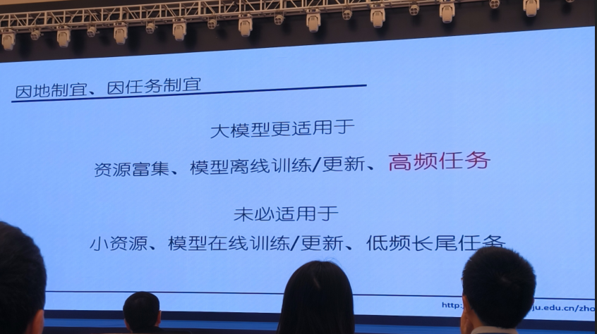

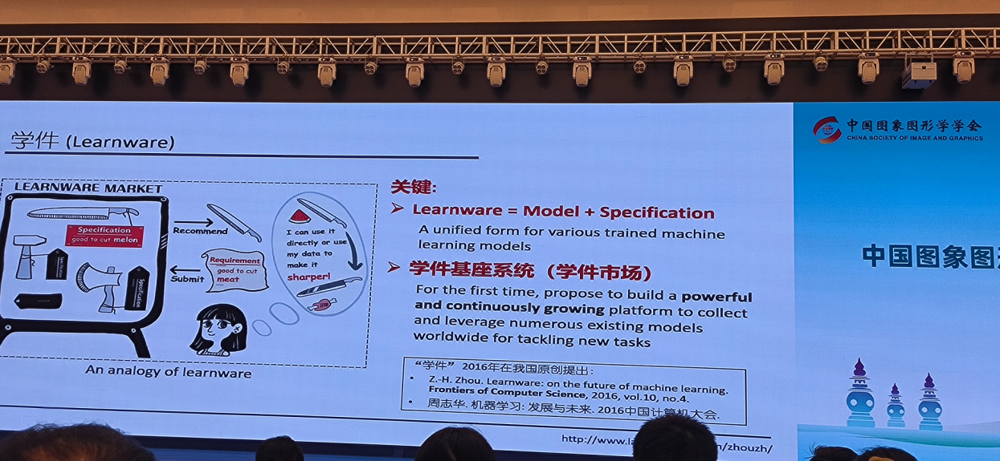

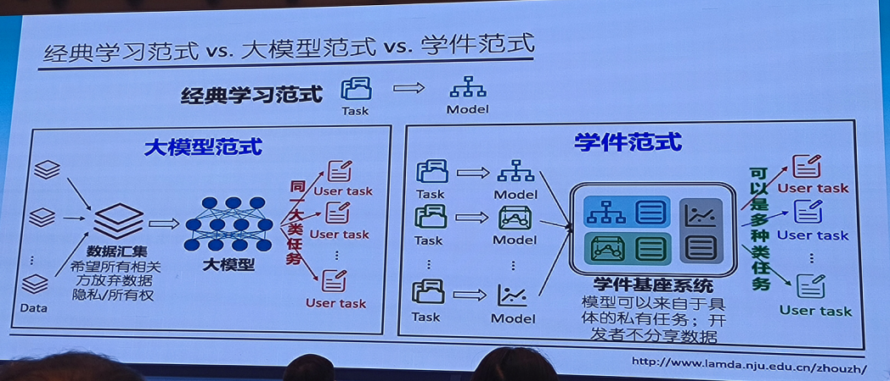
 学件（learnware）这一概念着实新颖，也只有这种级别的大佬才能提出原创范式。

 学件=模型+规约。可以类比为，模型是“刀”（工具），规约是“能切西瓜”（具体目的）。

 
对应还有很多新的概念：
- 规约整合、规约世界
- 错位学件
- 可成长规约
- 规约索引

 这一方向的未来目标：打造一个可成长可演化的学件规划系统。
 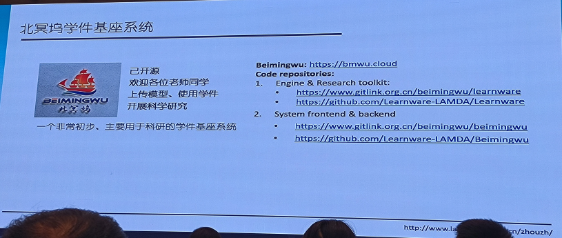

 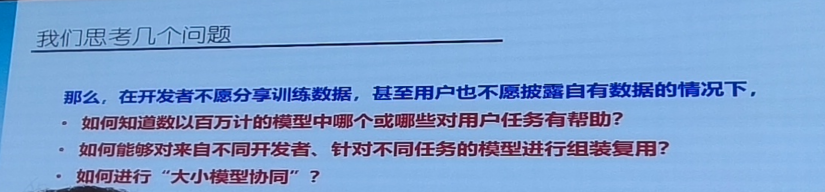

# 结语

 本次论坛是我首次参与的大型学术盛会，三天的沉浸式学习让我大开眼界。

 我深深陶醉于学术交流带来的视野拓展与思维碰撞。每一场报告、每一次讨论都让我受益匪浅，让我不仅看到了学术前沿的最新成果，也激发了我对科研的更多思考和热情。通过与各位专家学者的交流，我不仅拓宽了自己的学术视野，还收获了许多宝贵的建议和启示。

 这次论坛对我来说，不仅是一次知识的洗礼，更是一次心灵的激励。我感受到学术的无穷魅力，也更加坚定了自己在科研道路上不断前行的决心。在此，我衷心感谢导师的栽培和指导，感谢每一位与我分享经验的同仁，期待未来能有更多这样的机会，与大家共同进步、共同成长。
