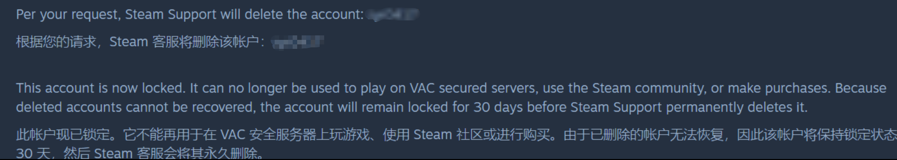
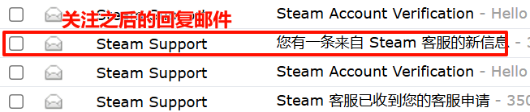
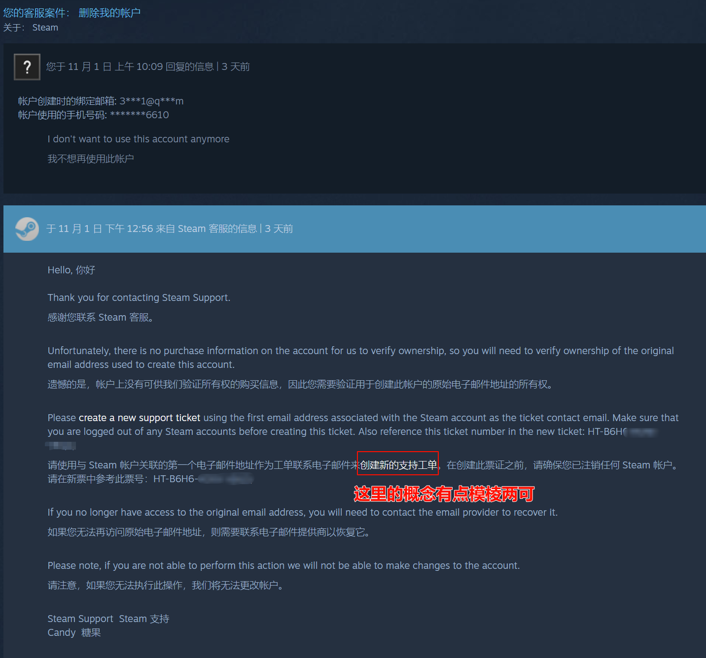
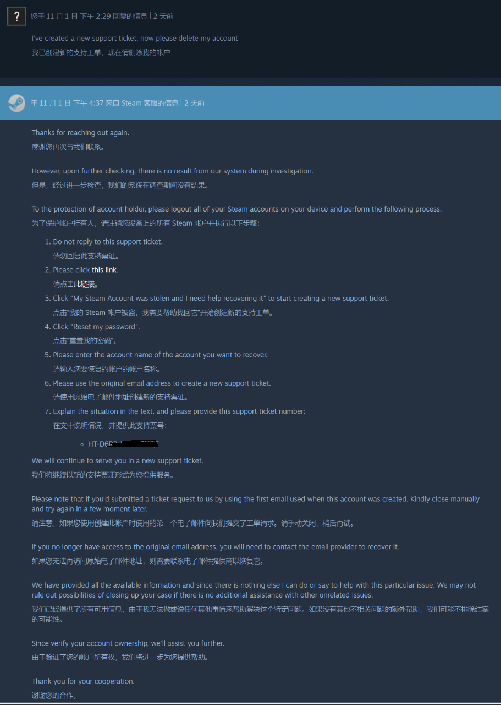
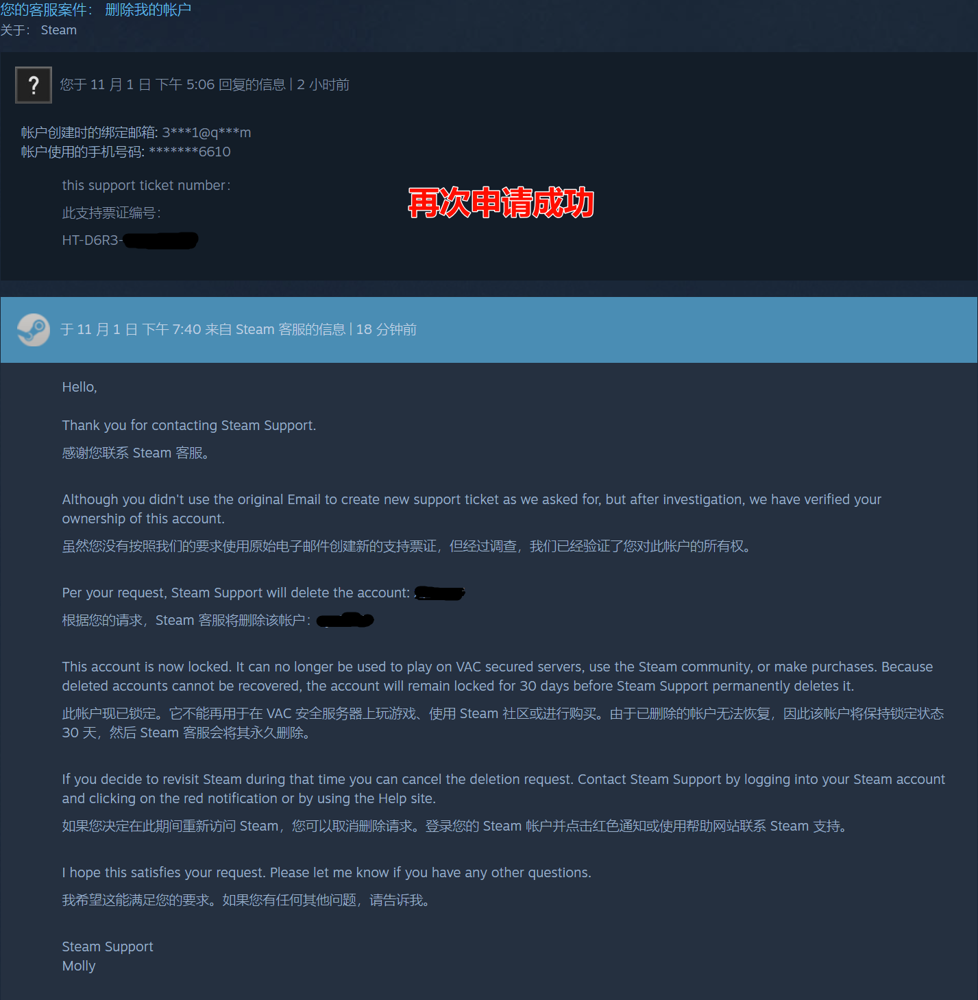

## 前言

 我一个闲置已久的Stream账号，由于账号和密码设置过于简单，而频繁遭到盗号。

 虽然没往里面充值，也没有什么经济损失，但老是让我收到Stream异常登录的垃圾邮件，这一点着实麻烦。

 于是，我曾尝试过账号删除。但一段时间后，仍然收到该账号的垃圾邮件——账号没有删除成功。

 现在，我再次删除账号，并经过资料收集和亲身试验，解决了这一问题。

## 方法

 
**1.在账号页面，申请过“删除账号”，请关注之后stream发的后续邮件。**

 
我之前就是由于没关注邮件信息，而错过了删除验证时间。

 

**2.重新在stream注销账号，选择“找回账号”，重置密码**

 这里stream客服的回复邮件中，“创建新的支票工单”的说法，确实比较模棱两可。

 我再次重申后，客服给出了具体的操作流程。

 可能是因为我的账号被异常登录过，所以我需要验证自己是原主人，需要找回账号。

 按照客服的流程，重新操作。

 

**3.重新申请“删除账号”，并在申请理由中，附上前一个客服回复里的票证编号（ticker number）**

 等待客服的回复邮件，基本上同一天就能收到。

 

**得到回复——删除成功！！！**

