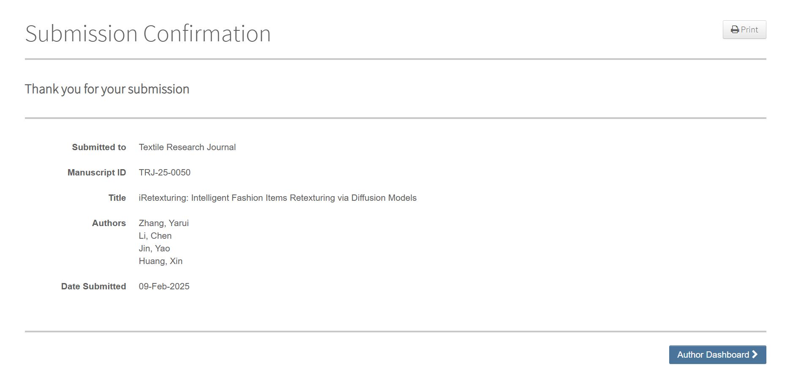

  
>上图是我收到论文成功提交的通知。投递完成的那一刻，压在心头长达半年的重担终于卸下，仿佛整个人都轻松了许多。

---

## 前言

<br>大三上学期初，我尝试着定下目标：在本学期内完成一篇SCI论文的撰写。随着研究深入，渐渐意识到自身能力的不足，最终延期至寒假才得以完成投稿。

<br>这半年间，我利用课余时间在实验室摸索，寒假期间也继续补做实验。虽然论文目前仍在审稿中，但这段经历让我对科研工作有了粗浅认识，斗胆分享几点或许不够成熟的经验，主要聚焦于“如何系统性地搭建科研工作流”。


## 我的写作框架和写作流程

<br>通过与多位老师的讨论，结合SCI顶刊和实际写作经验，我总结出了具有代表性的（计算机）期刊写作框架：


```markdown
Abstract摘要
Keywords关键词

1.Introduction引言

- 第一段，引入本技术的应用前景
- 第二段，相关的基础工作
- 第三段，概述本文的方法
- 第四段，讲本文的贡献点（创新性）

2.Related Work相关工作

- 2.1 引入相关工作1
- 2.2 相关工作2

3.Method

- 3.1 Overview概述本文的方法pipeline
- 3.2逐步讲解各个步骤

4.Experiments

- 4.1.Dataset数据集来源
- 4.2.Evaluation Metric说明测量指标
- 4.3.Implementation Details实验实施的细节
- 4.4.Baseline Method测试基线方法的说明
- 4.5. Comparison with State-of-the-art测试结果的说明
- 4.6. Ablation Study论文自我比较的结果

5.Conclusion and Limitations广泛讨论

References
```


<br>同时，在长达半年的科研过程中，我建议的写作流程大致如下：

```
文献调研与选题——论文方法构建——实验准备与数据集测试——论文作图与初稿撰写——论文润色——投稿论文的word与latex准备——选刊与投稿
```


# 写论文的几个必备环节

```
1. 总体论文框架构思
2. 实验指标，数据集
3. 论文作图
4. word写作，latex写作
5. 论文润色
```

---
## 1. 论文框架怎么想清楚

<br>**写论文前要先读别人的文章，找到自己的方向**

<br>刚开始导师给我推荐了几篇论文，我就从这些出发，在组会汇报过程中慢慢扩展阅读量。这里分享我的文献阅读方法：

<br>**实用阅读技巧**
- 看英文文献时：
  - 快速浏览：用腾讯元宝或GPT把全文翻译成中文看个大概
  - 仔细精读：用Zotero导入论文，装个谷歌翻译插件随时查词
- 找文献时：
  - 去AMiner网站查热门研究方向
  - 在谷歌学术下载具体论文
- 做汇报时：
  - 用OneNote做笔记，Xmind画思维导图
  - 用学校PPT模板做幻灯片，OBS录屏保存

<br>这个过程确实很花时间，我和导师一起精读了三四篇论文才确定方向。**建议大家提前做好阅读计划，别像我一样走弯路**

---

## 2. 实验数据早准备

<br>**做实验需要提前找好数据**

<br>我吃过亏：写论文最后才发现需要补充数据集，结果要返工重做实验。所以最好在实验开始前就准备好这些：

<br>**找数据窍门**
- 用Perplexity智能搜索工具查找
- 首选Kaggle等公开数据平台
- 测试数据也要提前准备

<br>**经验教训**
- 别等到写论文时才找数据
- 做好数据备份和分类
- 记录清楚每个数据的来源

---
## 3. 论文作图

<br>**画流程图用draw.io这类软件准没错**

<br>第一次画论文里的示意图时，我照着之前看过的论文模仿风格。后来发现很多SCI论文图都是用draw.io做的，分享几个实用技巧：

- 在draw.io导出图片格式为SVG
	- 若要**找原数据**，可将图片导入Adobe Illustrator，经若干设置，再导出为SVG，可得到所有原图片
	- 若图片**在word中转PDF后**，格式有误差——可以在draw.io将图片导出为PDF，再用PDF工具将图片转为SVG，这样就删除了原始的不必要数据。
	- 若**图片过大**，可将图片导入PS，再在PS中导出为TIF，这样图片大小就明显压缩，且在word中可显示

---

## 4. 用word还是latex

<br>**大部分SCI期刊都支持或（仅要求）word格式的论文，也有部分支持latex格式。**

<br>像我当初刚写初稿时，用的是markdown格式，而且是中文的。之后转latex写作，**发现中文markdown转latex有门槛**。之后又为了适合多家期刊投稿要求，要**中文latex转word，这也有门槛**。中间耗费的不少时间。

<br>我走过的弯路：
1. 先用中文markdown写初稿
2. 转成latex时各种格式错乱
3. 后来要转word又出现乱码

<br>最头疼的问题：
- 中文转latex容易报错
- latex转word图片会移位
- 参考文献链接全失效

<br>**所以建议，写初稿，还是在word中写，再根据期刊要求，可以转写latex（不要直接格式转换，而是全部重写）。能latex就尽量latex。**

---

## 5. 英语润色工具

<br>**亲测好用的DeepSeek-R1**

<br>我之前写作的迭代思路是，写完中文版的论文稿，再交给翻译软件转译为英文版的，来投稿SCI。但发现其中有不少问题：
- 翻译后，语言无法保持学术风格
- 翻译后，专业术语无法统一

<br>我也尝试过用不少AI工具来帮助润色：比如AMiner的润色工具，Nature推荐的GPT润色提示词，DeepL的学术润色工具等。但都是不符合预期要求（语言质量不达标）。

<br>但直到用上DeepSeek-R1：
- 改写后的句子立刻有学术味儿了
- 术语表达更专业
- 最后投稿版本全靠它润色

<br>**原因分析：**
<br>作为初学者，自己写的英文底子太差，普通AI只能小修小改。DeepSeek能整体提升语言水平，让文章更像专业论文。


# 结语

<br>这半年的科研时光，我一步步从零到一地完成论文，感触颇丰，收获颇丰，掌握了许多技能。非常感谢老师们的悉心指导。

<br>之后若有时间，我再详细讲讲科研各阶段，我是如何实操解决问题的。
<br>例如：
- [ ] 如何用DS润色语言
- [ ] word和latex写作技巧