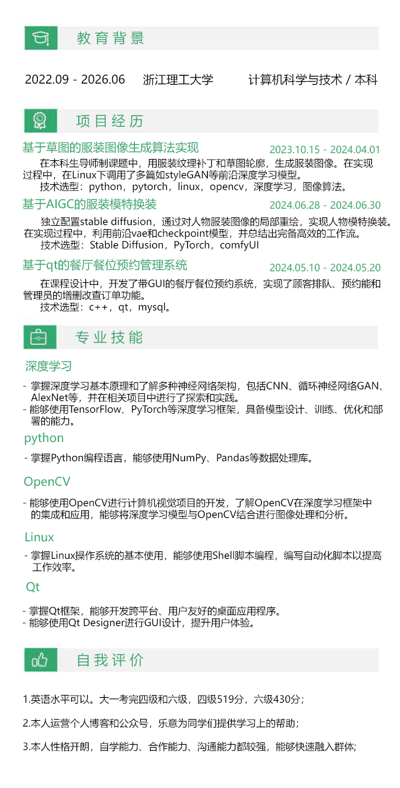

> 实习下班的晚上，终于吃上了那家排队超长的网红黄鱼面。酥脆的小黄鱼泡在奶白鲜汤里，瞬间治愈了加班的疲惫。

## 前言

 前些天实习时的主管约饭，聊起近况时她说："你当时在实习期间的工作效率非常高，是公司这么久以来表现最出色的实习生。"这话让我有点意外。

 大二暑假前我还是个啥都不会的小白，从投简历入职到边工作边学本领，最后还靠这份经历写出SCI论文。这段经历带给我的，远比想象中多。

 最近好些同学问我怎么大二就能找到实习，下面我来简单聊聊。

---

## 我们为什么要实习  

 真正走进职场才会明白，学校里学的教材往往跟不上行业变化。实习不仅能接触最新技术，更重要的是提前适应工作节奏，学会如何与同事协作完成任务。这些经历是课堂给不了的成长。

---

## 零经验也能找到机会  

 回想大二那年，我转入计算机科学与技术才一年，连基础项目经验都没有。后来跟着实验室导师学了一个星期SD技术，做出了简易版人物换装demo。这个稚嫩的项目却成了我简历里的敲门砖，最终帮我拿到了AIGC岗位的实习。其实中小公司更看重实践意愿，能证明你上手就能干活的项目，哪怕简单也足够。

---

## 简历怎么写才有戏  

 写简历时，可以从教育背景、项目经验、专业技能和自我评价这几个方面入手。如果项目经验少，就把课程设计或相关作业写进去，尽量展现和岗位的关联性。专业技能部分突出核心技术，再加点说明，自我评价里可以写语言能力、志愿经历或学术活动。如果觉得不够有说服力，不妨在第二页放上项目截图，证明你确实有东西可展示。

> 我第一次投递用的简历，其中的项目写法可供大家学习

---

## 先从小公司起步  

 对于双非本科生来说，投简历最好从中小型公司开始。小公司一般有20到99人，中型公司大概100到500人，这些地方竞争没那么激烈，更容易起步。投递时，挑和自己项目经验匹配的岗位，这样成功的几率更高。

---

## 面试的真心话  

 面试的时候，有些问题要答得聪明点。如果被问到能实习多久，尽量说六个月以上，公司都喜欢能待得久的实习生，就算后期有变故，到时再说个人原因就行。问到薪资期待时，别说“随便”或者“管吃住就行”，得根据岗位薪水范围给个合理数字，不然容易被压价。只要准备充分，实习就能成为你进入职场的关键一步。

___

## 结语

 回想自己的实习经历，从零经验到拿到offer，我发现关键不在于起点高低，而在于迈出第一步的勇气和坚持。只要你愿意尝试，哪怕从简单项目入手，也能打开职场的大门。希望你也能找到适合自己的方向，不畏起步的小，用行动证明自己的价值。实习不是终点，而是通往更大舞台的起点，加油！