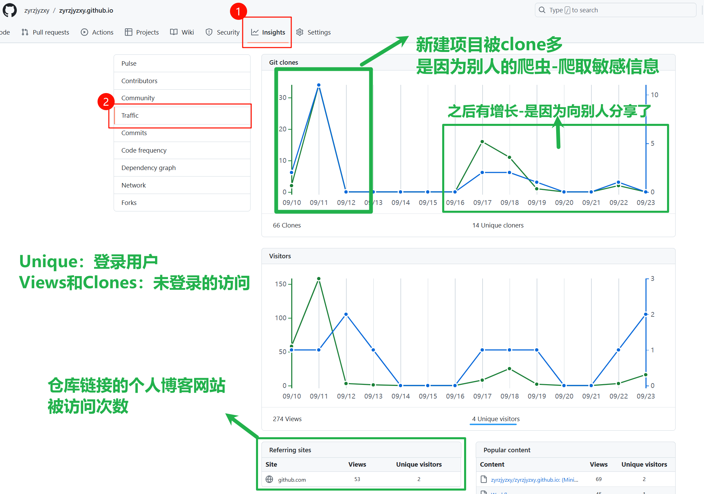

## 前言

 为了看看自己新建的博客网站有多少浏览量，打算用一些工具。发现GitHub的仓库页面就有自带的浏览量检测工具——Insights。

 打开Insights后，发现各项数据的概念不清，网页中也没有相关解释。很多数据若没有先行了解，直接主观臆断的话，会产生很多相悖的结论。

 所以，接下来研究下Insights的基本数据，以及一些不为人知的潜规则结论。

# 个人一图流解释

 以个人博客网站为例：

 需要注意的几点：

- 仓库的创建者，在未登录的情况下访问自己的仓库，会使**Views**增加；若已经登录，则不会增加访问次数。而其他人的访问一定会增加次数，具体加在Views还是Unique上，就看登录状态了。
- 由上面数据可知，就算是刚新建的repo，也会被一些不速之客截取。所以，就算作为初学者，在新建仓库前，也一定要保护好自己的敏感信息，别把私有api给发上面了。

 PS：传言之前的上海公安局数据库泄露，就是因为有`大聪明`把**公民数据库的阿里云API放CSDN的博客上**了，造成了多大的安全损失不言而喻。。。。。

# 参考来源

## 参考issue：

[仓库 Insight 下的流量 ·社区 ·讨论 #23048 --- Traffic under Insight of repository · community · Discussion #23048 (github.com)](https://github.com/orgs/community/discussions/23048)

## 推荐回答：

# 后续计划：

 **更新清除commit记录的博客**

[清除Github提交历史记录 - 知乎 (zhihu.com)](https://zhuanlan.zhihu.com/p/35078876)

