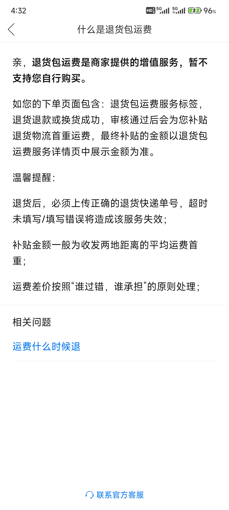
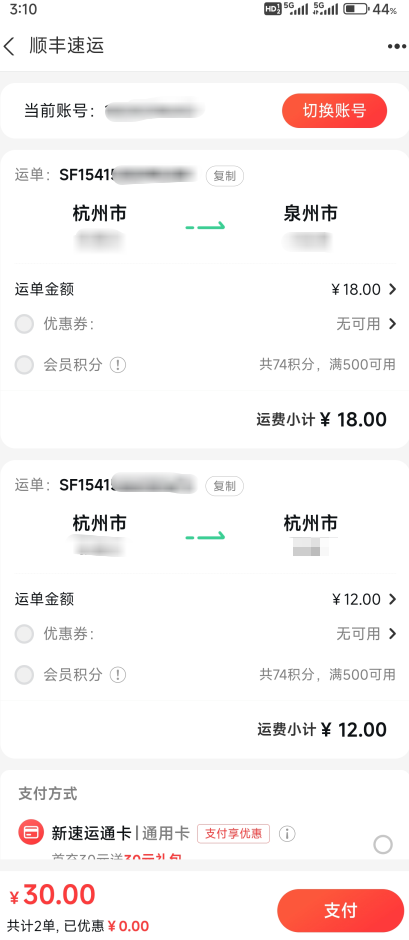
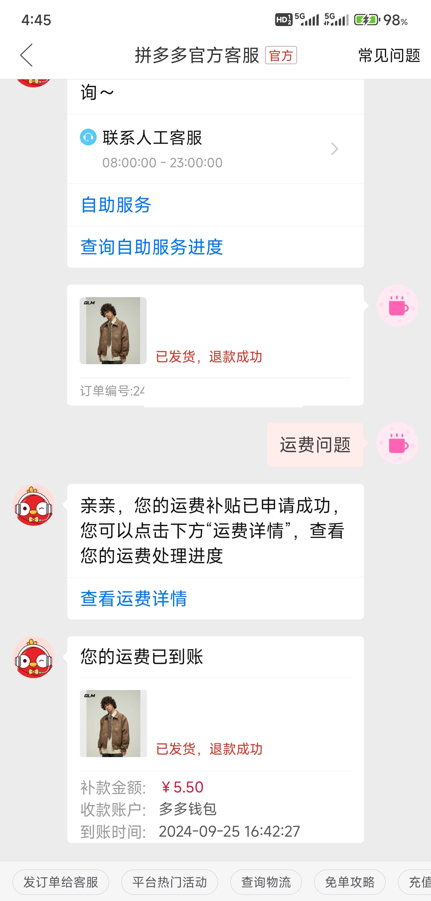
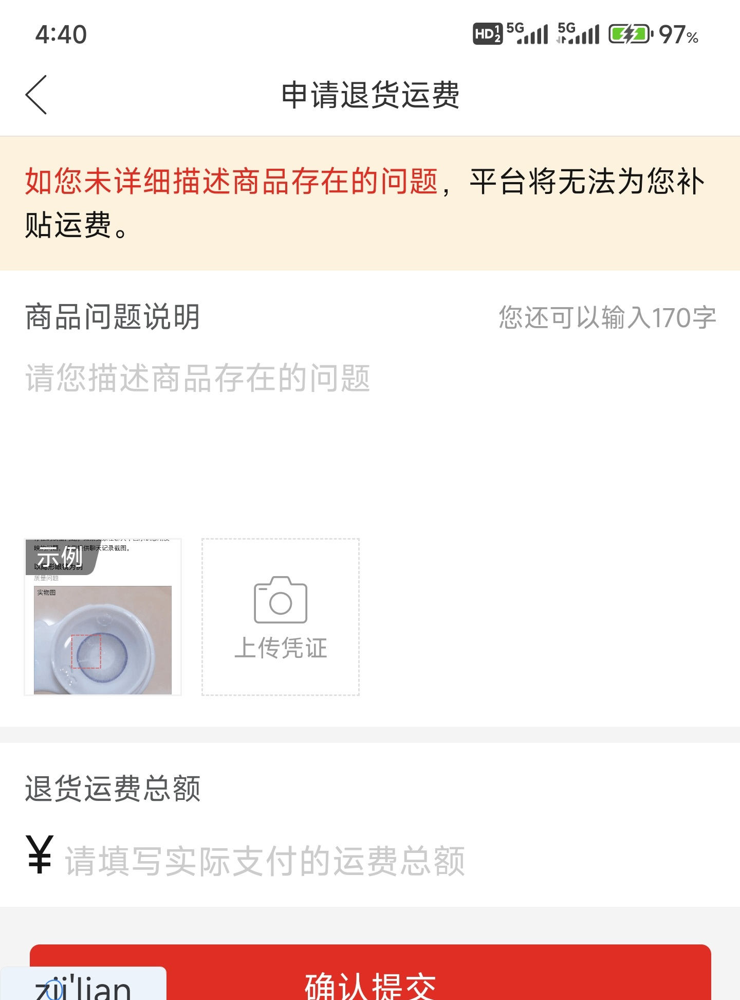
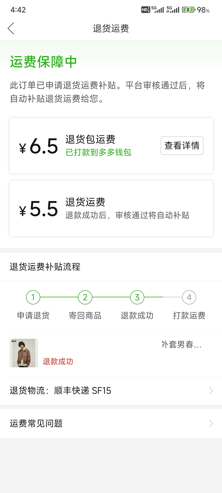

## 前言

 拼多多退货时，如果申请的是自行寄回，则需要自己找快递商寄快递。并且，运费要自己垫付。这就导致了，退货时运费没有补齐的问题，通常平台退回的运费都会比实际运费少。

 经过个人生活经验，总结出如何百分百拿到全款退货运费的方法。

# 1.购买前挑好商家服务

 买东西前，先看商家有没有**退货包运费**服务，这样也是为了方便我们无阻碍退货。

# 2.退货理由要写商品质量问题

### 政策说明

 退货前，要先知道，PDD的退运费的政策说明：

**可以看出，退货运费补齐是要在商品质量问题的基础上**

### 申请填写

 所以说，填写时可以选择商品质量不好，理由正经写就行。

### 保留退货运费信息

 运费信息作为之后的退货依据

# 3.退货理由写成“不想要了”怎么解决？

 在该已经退款订单中，申请人工，并选择“运费问题”。

 重新填写退货原因，和实际退货费用。

 这样就得到补款啦。

