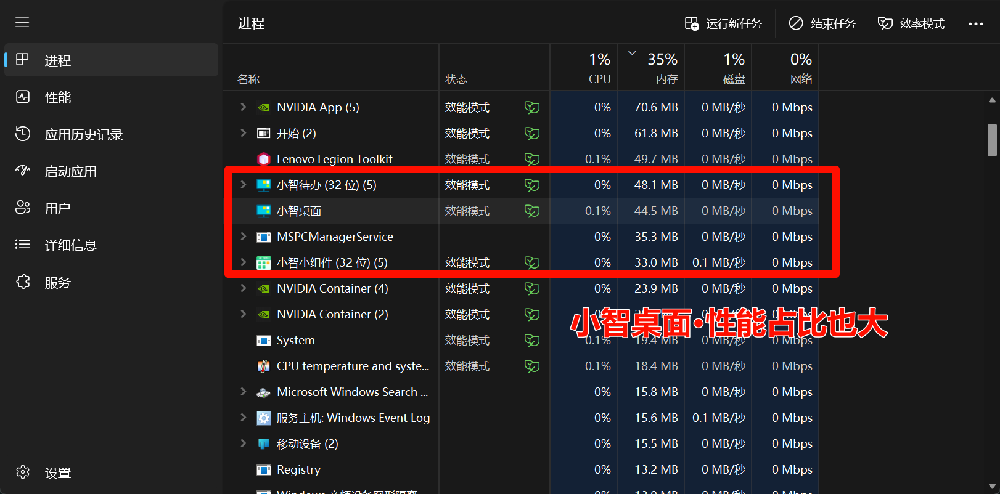
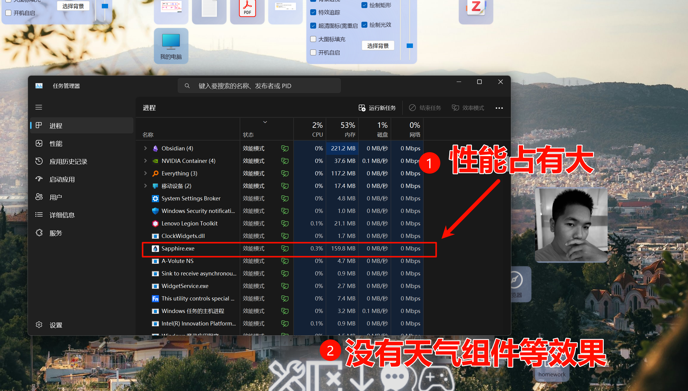
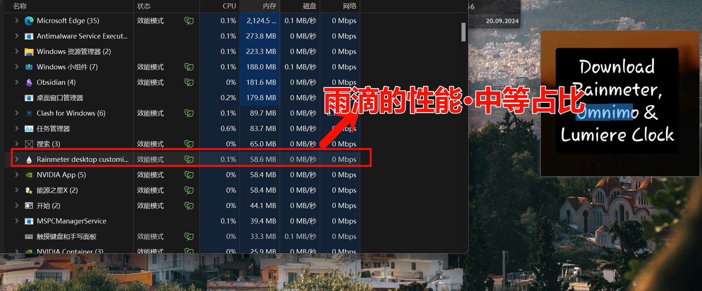
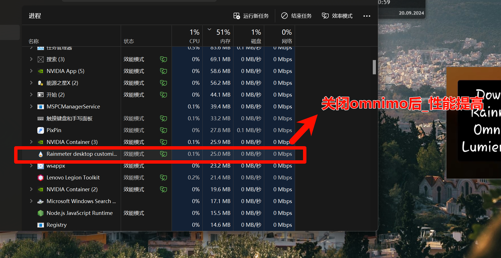
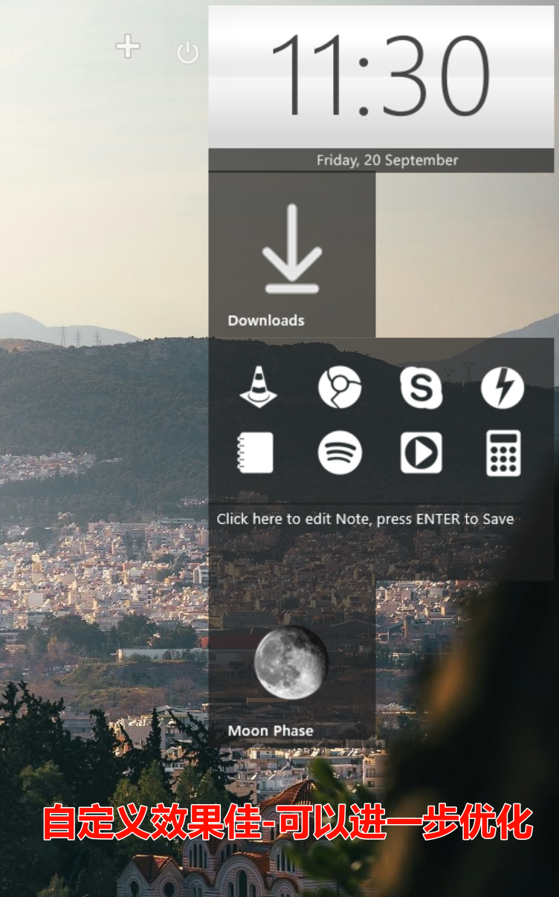
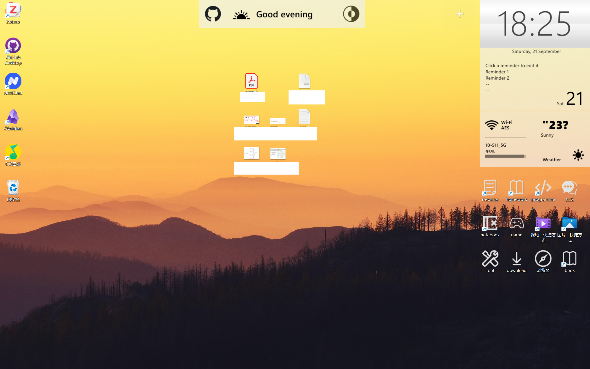

## 前言

 在桌面美化这一领域中，市面上已经有了大量的软件。但质量往往参差不齐，有些软件很臃肿，有些软件付费内容多。由于个人对PC环境有洁癖，但又追求实用性。于是，我基于下面几点目标，探索最适合本人使用习惯的桌面美化软件：

- 在不改变原始win的使用习惯下，对桌面进行美化
- 后台的进程，需要轻量、占性能损耗小
- 简洁干净的界面小组件，且需要一定的实用价值，例如能看天气、日历、计划等

 

# 主流软件分析

 本次分析实验，对三个主流软件进行对比，以探索出最合适个人需求的软件。
 

## 闭源商业-小智桌面

 本人之前一直在用的桌面美化是小智桌面，但小智桌面一直以来都有以下缺点：
- 过于商业化
- 自定义效果差
- 软件臃肿
 

**性能评估：**

 最关键的是，性能占比过大——故舍弃，探索其他软件。
 

## 开源-Sapphire

 基于对轻量、简洁的要求，开源软件往往能符合这一特征。

 目前网络上评价较高的开源桌面美化软件：Sapphire

 开源项目地址：[hymnly133/Sapphire-EnhancedDesktop: Windows桌面取代软件 (github.com)](https://github.com/hymnly133/Sapphire-EnhancedDesktop)

**效果分析：**

 但经过个人测试实验后，发现了Sapphire目前还是有着不小的问题，如上图。于是舍弃。

## 好评如潮-Rainmeter+Omnimo

 最后，我将目光锁定在一款好评如潮的桌面美化软件：**Rainmeter（雨滴桌面）**

 Rainmeter有丰富的第三方插件生态，可以自定义组件效果。其中，Omnimo组件库更是以简洁轻量著称

### Omnimo极简插件示例

 参考教程：[如何让你的桌面看起来既专业又干净_哔哩哔哩_bilibili](https://www.bilibili.com/video/BV1MH4y1o7dz/)

**性能评估：**

**自定义组件：**

# 最终效果：

 经过以上功能探索后，我确定了最符合个人要求的桌面设计：

- 简洁的小组件设计。简单的组件功能，包括时间、天气、网络、计划清单、日夜切换。
- 保留了原系统的操作逻辑。没有添加docker栏或修改图标格式。
- 文件区、应用区、组件区、快捷文件区，分开明确。左边应用，中间文件，右边组件和快捷文件。
- 性能占用小。依据轻量的Omnimo组件库，进程占比50MB左右。
