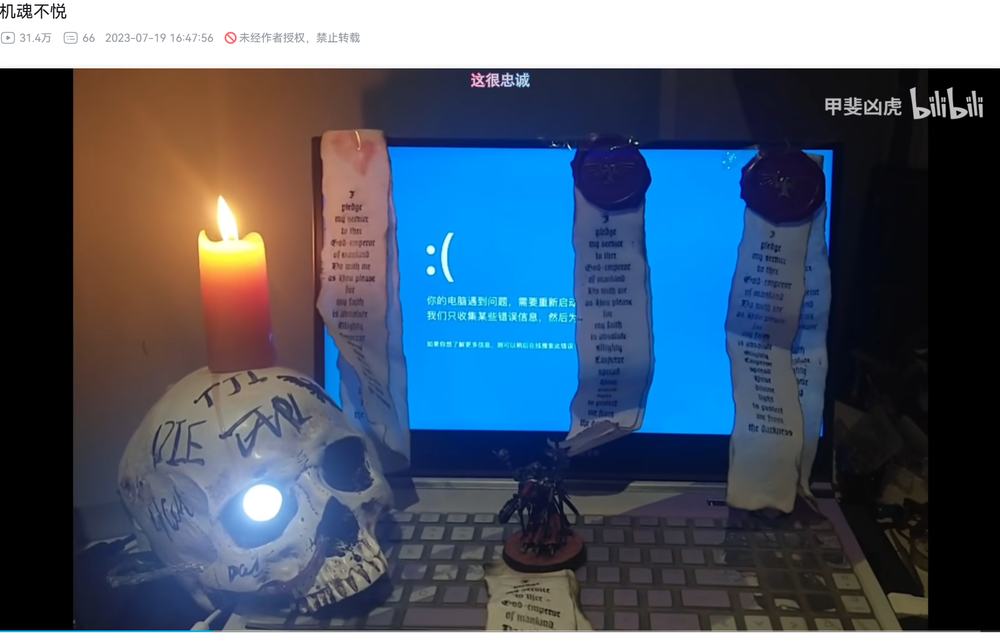

# 机魂不悦

## 前言

<br>最近看完《秘密关卡》，对其中“战锤40k”那一集比较感兴趣。了解了一下相关背景。

<br>发现“战锤40k”这一ip确实魅力非凡。也刷到这个“机魂不悦”的梗，非常有意思。

___

## 解释

<br>关键知识点:  

<br>
```
战锤40k的大致历史梗概  
帝国真理与机械神教之间的关系  
机械教在大远征中的作用  
机械教的教义,以及求知的主要方式  
战锤40k的规则书  
```
<br>
___


<br>简易解释"机魂不悦":  

<br>
```
机械教认为一切机械皆有机魂, 机魂不悦将意味着机械工作可能出现不正常.  
举个例子,你有一台存在硬件问题,时不时会死机并且重启的电脑, 一般意义上的机魂是指这台电脑的操作系统, 概念意义上的机魂是指的是虚泛控制这台电脑整体工作状态的存在. 给电脑涂点工程油,用扳手敲击机箱,启动电脑时唱赞美诗能取悦机魂,将会让你玩电脑时机器死机的概率减小,增强处理器的计算能力等...........更脱离游戏一点,明面上是你加装水冷,调电压完成超频,实际上是加水冷,调电压的这个过程是机魂所喜爱的,机魂大悦,所以机魂给了你更多的算力.........(如果翻车漏水,机魂不悦......)
```
<br>


___

<br>之后就可以这么玩meme——跑程序出bug，表示我的电脑“机魂不悦”了哈哈哈哈。